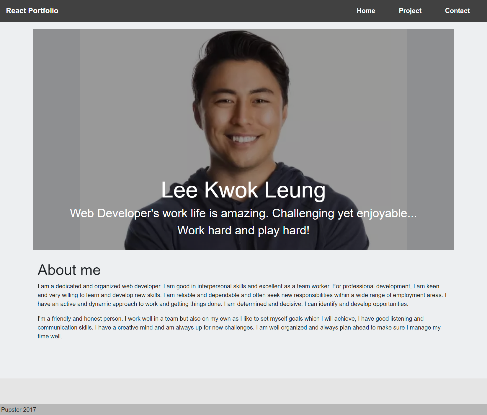

# React Portfolio

This application uses React to create a scaffolding of my portfolio sites.

## Description

A portfolio of work can showcase your skills and talents to employers looking to fill a part-time or full-time position. An effective portfolio highlights your strongest work as well as the thought processes behind it. A web developer who have portfolios with deployed web applications are typically very successful in their career search after the boot camp. It is tasked to create a portfolio using React.

---

 ## Table of Contents
  * [Description](#description)
  * [User Story](#user-story)
  * [Technical Acceptance Criteria](#technical-acceptance-criteria)
  * [Mock-Up](#mock-up)
  * [Review](#review)
  * [Helpful Resources](#helpful-resources)

---

## User Story

AS A web developer, I WANT to practice my web development skills by building a portfolio of work using React which will become something I can showcase my skills in job search.

---

## Technical Acceptance Criteria

* Technologies that must be used:
  * [ ] React
  * [ ] Navigation with `React Router`, dynamic rendering, or another third part router
* Your portfolio **must contain** the following information:
  * [ ] Your name
  * [ ] Links to your:
    * [ ] GitHub Profile
    * [ ] LinkedIn Page
    * [ ] Email Address
    * [ ] Phone Number - (optional)
    * [ ] PDF version of your resume
      * Your resume **must** contain up-to-date projects and professional experience
    * [ ] A list of projects (Challenges or Projects). For each project, make sure you have the following:
      * [ ] Project title
      * [ ] Link to the deployed version
      * [ ] Link to the GitHub repository
      * [ ] GIF or screenshot of the deployed application

### Required Components

* At a minium, your portfolio must render these 6 components:
  1. [ ] App
  2. [ ] Header
  4. [ ] Home
  5. [ ] Project Gallery
  6. [ ] Project
  7. [ ] Contact

### Required Component Content
* [ ] App:
  * [ ] Must be your top level component and render all necessary children components
* [ ] Header:
   * [ ] Must be rendered across the entire site
   * [ ] Must Contain a Navbar
* [ ] Project Gallery:
  * [ ] Must render dynamically 6 instances of the Project component
    * [ ] Be sure to store your project data in a JSON file and import it into your project
* [ ] Project:
   * [ ] Must be a reusable component that ingests JSON data as a props and renders a single instance for each project.
   * [ ] Must utilize router props to properly render the right project based on user selection
   * [ ] Must render the following info:
     * [ ] Project title
     * [ ] Link to the deployed version
     * [ ] Link to the GitHub repository
     * [ ] GIF or screenshot of the deployed application
* [ ] Contact:
  * [ ] Must have contact information
  * [ ] Have a contact form for handling events
* [ ] Home:
  * This should be a welcome landing page that contains:
     * [ ] Your Name
     * [ ] A Headshot of you
     * [ ] Your brand statement
     * [ ] Some indication that this is your portfolio site

---

## Mock-Up

TThe following image shows the web application's appearance and functionality:

---

## Review

TA, a Web Developer, reviews the code, providing feedback on errors and making sure that all of the acceptance criteria have been met.

* [The URL of the deployed application.](https://seacrest3.github.io/seacrest-react-portfolio/)

* [The URL of the GitHub repository.](https://github.com/seacrest3/seacrest-react-portfolio.git)

---

## Helpful Resources

- [Reactjs.org](https://reactjs.org/docs/introducing-jsx.html)

- [React Depolyment](https://create-react-app.dev/docs/deployment/#github-pages)

- [React - All The Pieces](https://gist.github.com/jdtdesigns/936839ea2cea6b4d3193b520c750a09b)

- [egghead.io](https://egghead.io/courses/build-a-name-picker-app-intro-to-react-hooks-context-api-1ded)

- [Netlify](https://www.netlify.com/)

- [React app deployment with GitHub](https://create-react-app.dev/docs/deployment/#github-pages)

- [freeCodeCamp.org](https://www.freecodecamp.org/)

- [Github Pages Guide](https://pages.github.com/)